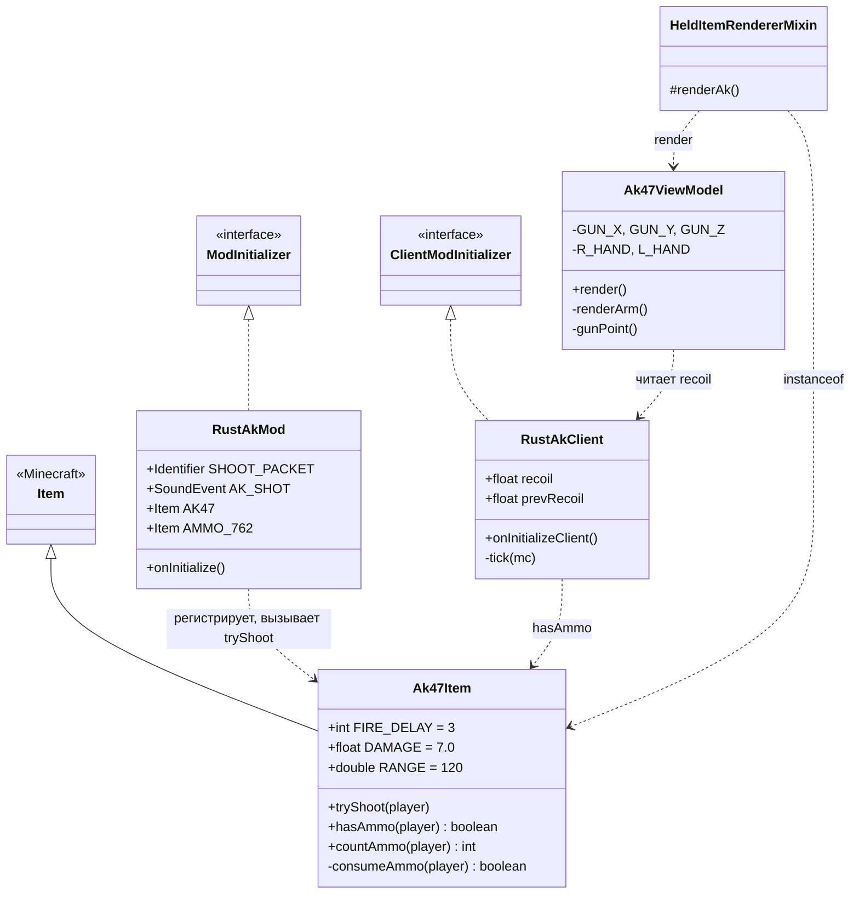
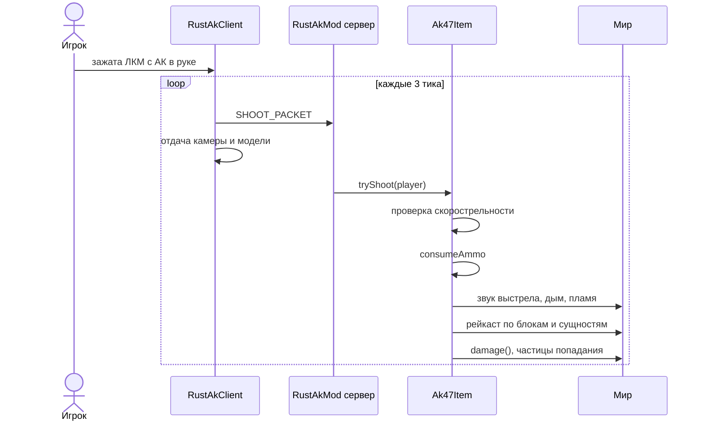

# UML мода Rust AK-47

GitHub сам рисует блоки `mermaid` прямо в Markdown, ничего ставить не нужно.

## Диаграмма классов

```mermaid
classDiagram
    direction TB

    class ModInitializer {
        <<interface>>
    }
    class ClientModInitializer {
        <<interface>>
    }
    class Item {
        <<Minecraft>>
    }

    class RustAkMod {
        +Identifier SHOOT_PACKET
        +SoundEvent AK_SHOT
        +Item AK47
        +Item AMMO_762
        +onInitialize()
    }
    class Ak47Item {
        +int FIRE_DELAY = 3
        +float DAMAGE = 7.0
        +double RANGE = 120
        +tryShoot(player)
        +hasAmmo(player) boolean
        +countAmmo(player) int
        -consumeAmmo(player) boolean
    }
    class RustAkClient {
        +float recoil
        +float prevRecoil
        +onInitializeClient()
        -tick(mc)
    }
    class HeldItemRendererMixin {
        #renderAk()
    }
    class Ak47ViewModel {
        -GUN_X, GUN_Y, GUN_Z
        -R_HAND, L_HAND
        +render()
        -renderArm()
        -gunPoint()
    }

    ModInitializer <|.. RustAkMod
    ClientModInitializer <|.. RustAkClient
    Item <|-- Ak47Item

    RustAkMod ..> Ak47Item : регистрирует, вызывает tryShoot
    RustAkClient ..> Ak47Item : hasAmmo
    HeldItemRendererMixin ..> Ak47Item : instanceof
    HeldItemRendererMixin ..> Ak47ViewModel : render
    Ak47ViewModel ..> RustAkClient : читает recoil
```

## Диаграмма последовательности: один выстрел

```mermaid
sequenceDiagram
    actor P as Игрок
    participant C as RustAkClient
    participant S as RustAkMod сервер
    participant A as Ak47Item
    participant W as Мир

    P->>C: зажата ЛКМ с АК в руке
    loop каждые 3 тика
        C->>S: SHOOT_PACKET
        C->>C: отдача камеры и модели
        S->>A: tryShoot(player)
        A->>A: проверка скорострельности
        A->>A: consumeAmmo
        A->>W: звук выстрела, дым, пламя
        A->>W: рейкаст по блокам и сущностям
        A->>W: damage(), частицы попадания
    end
```
